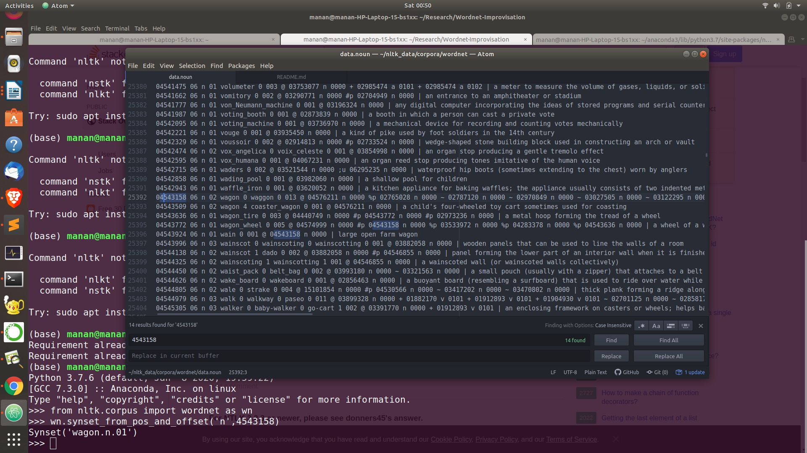
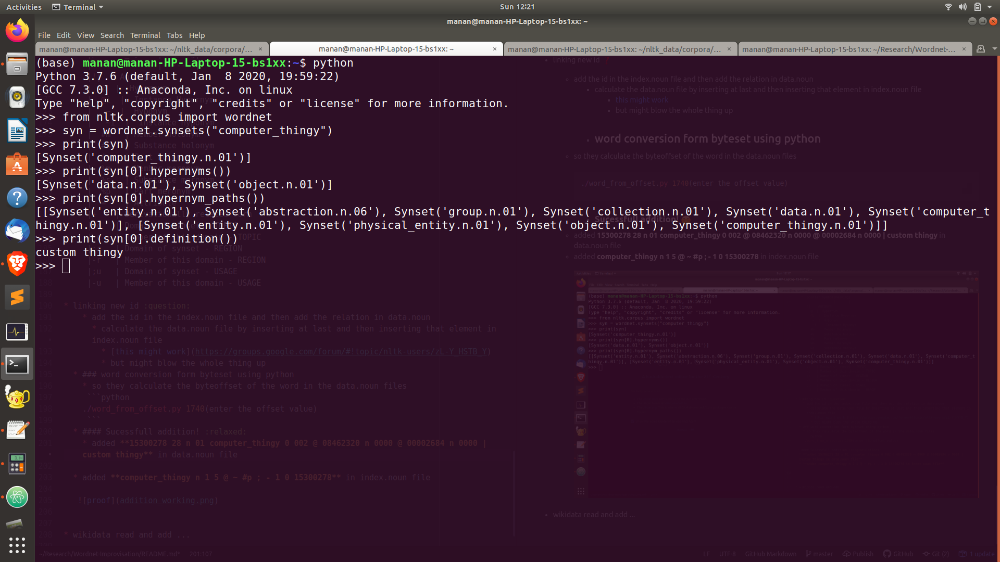

##  Wordnet Improvisation
#### Trying to build a ***tool***( :octocat: ) that can create onotologies and improve wordnet by adding technial terms.

## :question: Questions

#### 1. How wordnet works?
* Lexical Database of semantic relations between words.
* The relations of a word depend on its pos tag for eg. noun , verb etc.
  * So it depends on what words we classify as **concepts** and what are thier **pos tag**

#### 2. How are words related?(So many! :open_mouth:)

* **For Nouns:**

|       Relations           |
| ------------------------  |
|Antonym                :heavy_check_mark:    |
|Holonym                :heavy_check_mark:    |
|Meronym                :heavy_check_mark:    |
|Attribute                  |
|Derivationally related form|
|Domain of synset-TOPIC    :heavy_check_mark: |
|Domain of synset - REGION :heavy_check_mark: |
|Domain of synset - USAGE  :heavy_check_mark:|
|Member of this Domain-TOPIC|
|Member of this Domain-REGION|
|Member of this Domain-USAGE|

* **For Verbs:**


| Relations                           |
| ------------------------------------|
|   Antonym                           |
|   Hypernym                          |
|    Hyponym                          |
|    Entailment                       |
|    Cause                            |
|   Also see                          |
|    Verb Group                       |
|    Derivationally related form      |    
|    Domain of synset - TOPIC         |
|    Domain of synset - REGION        |
|    Domain of synset - USAGE         |

* I think we will require only nouns and verb :smirk:, but for reference use the following link
* Domain relations are not usefull to us , see this link **[Domans List](http://wndomains.fbk.eu/labels.html)**

:book: **[Documentation](https://wordnet.princeton.edu/documentation/wninput5wn)**

#### :bulb: 3. Which relations are we targetting to improve?
* This depends on the concepts we have formed.
* Our regexParser is the indicative of what words we are selecting to form the Relations.
```python
chunkGram = r"""Chunk:{<JJ.?>{0,2}<VBG>{0,1}<NN.?>{1,2}<VBG>{0,1}<NN..?>{0,2}<VBG>{0,1}}"""
chunkParser = nltk.RegexpParser(chunkGram)
```
* What **relations** are we extracting from ***wikidata***?

|Code |Relations       |
|---- |----------      |
|P279 |is a subclass of|
|P361 |is a part of    |

* Now evaluate **what types of words are selected by the parser?** :sweat:
 * They are basically nouns.

### 4. Exploring NLTK functions(all of the result in python notebook)
*  **Where is all the data?**
```bash
cd ~/nltk_data/corpora/wordnet
```

### 5. Methodology
* Now since we have every word picked and extracted from wikidata then all of them will be some form of noun.
* So what I am thinking is how would a relation converge into something like is a subclass of , is a word of.
* Python interface to wordnet will be using nltk
* [Relations](https://medium.com/parrot-prediction/dive-into-wordnet-with-nltk-b313c480e788)
### 6. Wordnet working
**[Very good study material](http://santini.se/teaching/sais/Ass1_PeerReviews/NeeleOnSegebladJesper_WordNet_V01.pdf):heart:**
* #### Structure
   * WordNet consists of three separate databases, one for nouns, one for verbs and one for adjectives
and adverbs.

   * ##### Synsets:
      * **Words are stores in the sense in which the appear**
   * The basic structure is synsets. These are **sets of synonyms, or more correct, near-synonyms**, since
there exists none to few true synonyms. Synsets contains a **set of lemmas, and these sets are tagged
with the sense they represent**. These senses can be said to be concepts, all of the lemmas (or words),
can be said to express the same concept. Word forms which have different meanings appear in
different synsets. For example the noun ***bank, has 10 different senses in WordNet, and thus it
appear in 10 different synsets. It also appear as verb in 8 different synsets.***

    * ##### Connection between synsets:
      * Each of these synsets are
also connected in some way to other synsets, expressing some kind of relation


### 7. How to add data locally.
 * All of the data is stored in ```data.noun``` file, understand how to read and process it and what does is indicate
 * it is basically sysnet id

 * #### Code to acess the word through sysnet id
    

```python
 from nltk.corpus import wordnet as wn
 wn.synset_from_pos_and_offset('n',4543158)
```
  * now think of doing the opposite work
###  8. Work left
  [wndb :heart:](https://wordnet.princeton.edu/documentation/wndb5wn)
  * id calculate :question:
    * calculate using the formula:
      **for the word "wagon"**


|lemma | pos  | synset_cnt | p_cnt | [ptr_symbol..]|sense_cnt|tagsense_cnt|synset_offset|  
|------|------|------------|-------|---------------|---------|------------|-------------|
|wagon | n    | 5          |4      |@ ~ #p %p      |5        |2           |04543158 03977966 09219858 04543509 02814533|

* ### How are the terms defined in index.noun file?
   * **synset_cnt :**
Number of synsets that lemma is in. This is the number of senses of the word in WordNet.

  * **p_cnt :**
   Number of different pointers that lemma has in all synsets containing it.
  * **synset_offset :**
Byte offset in data.pos file of a synset containing lemma . Each synset_offset in the list corresponds to a different sense of lemma in WordNet.
  * **sense_cnt :**
Same as sense_cnt above. This is redundant, but the field was preserved for compatibility reasons.
  * **ptr_symbol :**
A space separated list of p_cnt different types of pointers that lemma has in all synsets containing it.

  * **tagsense_cnt :**
Number of senses of lemma that are ranked according to their frequency of occurrence in semantic concordance texts.

* ### How are terms stored in data.noun file?
|synset_offset | lex_filenum |  ss_type | w_cnt | word | lex_id |[word  lex_id...]|p_cnt[ptr...][frames...]| gloss(ptrs) |
|------------- |-------------|----------|-------|------|--------|-----------------|------------------------|------ |
|04543158| 06 |n |02 |wagon| 0 |waggon 0| 013| @ 04576211 n 0000 |
|04543158| 06 |n |02 |wagon| 0 |waggon 0| 013| %p 02765028 n 0000|
|04543158| 06 |n |02 |wagon| 0 |waggon 0| 013|~ 02787120 n 0000 |
|04543158| 06 |n |02 |wagon| 0 |waggon 0| 013|~ 02970849 n 0000
|04543158| 06 |n |02 |wagon| 0 |waggon 0| 013|~ 03027505 n 0000
|04543158| 06 |n |02 |wagon| 0 |waggon 0| 013|~ 03122295 n 0000
|04543158| 06 |n |02 |wagon| 0 |waggon 0| 013|~ 03558841 n 0000
|04543158| 06 |n |02 |wagon| 0 |waggon 0| 013|~ 03690600 n 0000
|04543158| 06 |n |02 |wagon| 0 |waggon 0| 013|~ 03765467 n 0000
|04543158| 06 |n |02 |wagon| 0 |waggon 0| 013|~ 04468847 n 0000
|04543158| 06 |n |02 |wagon| 0 |waggon 0| 013|%p 04543772 n 0000
|04543158| 06 |n |02 |wagon| 0 |waggon 0| 013|~ 04543924 n 0000
|04543158| 06 |n |02 |wagon| 0 |waggon 0| 013|~ 04563020 n 0000

 * **lex_filenum :**
 Two digit decimal integer corresponding to the lexicographer file name containing the synset.

* ### What things from data.noun are useful?
1. #### Synset offset
2. #### Ptr count
3. #### Ptr format

   * |pointer_symbol | synset_offset|  pos|  source/target|
     |-------------- |--------------|-----|---------------|
     |@| 04576211| n| 0000 |

4. #### Ptrs symbols
   * |pointer_symbol|meaning|
     |--------------|-------|
     |!|    Antonym
     |  @  |  Hypernym
     |  @i  |  Instance Hypernym
     |   ~  |  Hyponym
     |   ~i  |  Instance Hyponym
     |  #m   | Member holonym
     |  #s   | Substance holonym
     |  #p   | Part holonym
     |  %m   | Member meronym
     |  %s   | Substance meronym
     |  %p   | Part meronym
     |  =    | Attribute
     |+    | Derivationally related form         
     |;c   | Domain of synset - TOPIC
     |-c   | Member of this domain - TOPIC
     |;r   | Domain of synset - REGION
     |-r   | Member of this domain - REGION
     |;u   | Domain of synset - USAGE
     |-u   | Member of this domain - USAGE

* linking new id :question:
    * add the id in the index.noun file and then add the relation in data.noun
      * calculate the data.noun file by inserting at last and then inserting that element in index.noun file
        * [this might work](https://groups.google.com/forum/#!topic/nltk-users/zL-Y_HSTB_Y)
        * but might blow the whole thing up
  * ### word conversion form byteset using python
    * so they calculate the byteoffset of the word in the data.noun files
     ```python
    ./word_from_offset.py 1740(enter the offset value)
     ```
  * #### Sucessfull addition! :relaxed:
    * added **15300278 28 n 01 computer_thingy 0 002 @ 08462320 n 0000 @ 00002684 n 0000 | custom thingy** in data.noun file

  * added **computer_thingy n 1 5 @ ~ #p ; - 1 0 15300278** in index.noun file

   


* wikidata read and add ...
  * every concept --> node
  * node --> children (is a part of , is a subclass of)
  * node search , add the words untill the chain is completed.
    * node found :
       * relationship not found : data.noun , index.noun add -->offset change.
    * node not found : then add in last
      * parent will acess children , but vice -versa not true
  * **solution** : add in the last line duplicate elements of the modified node.

 * Aditya ---> graph traversal , node - relationship identification

    * node ....
    * node existing, new relationship defining.
    * node not found
 * runtime -- 14000(2min)
 * Manan   (4cases--> function)
           (Hashmap from index.noun data.)
* ## How to run the files and which shell files to run:

  * List of the shell files present

      * backup.sh(present in the folder  helper)--> to be put in /home/manan(aditya)/nltk_data/corpora/wordnet folder
      * new_test.sh(present in the folder helper)--> to be put in /home/manan(aditya)/nltk_data/corpora/wordnet folder
      *	run_mode.sh(present in the folder helper)--> to be put in /home/manan(aditya)/nltk_data/corpora/wordnet folder
      * refresh.sh
  * Purpose of each shell file in
     * backup.sh : to make backup of index.noun file and the data.noun file so that we can recover the file in case it is destroyed
     * new_test.sh : it reverts all the changes made in test files(index2.noun and data2.noun) back to normal so that we can test again on it.
     * run_mode.sh : it reversts all the changes made in real files(index.noun and data.noun) using the backup files.
     * refresh.sh : it clear the data.txt file so that offset updation is mantained.
  * Order in which each of the file should be executed:
     * Firstly the file backup.sh should be run to create backups of the main file
     * then in the python file(improviser.py) index.noun and data.noun have to changed to index2.noun and data2.noun so that they target the test files and not the main files
     * then you should run the bash file new_test.sh to prepare for the testing
     * then you should the run the python file and see the results in the index2.noun and data.noun file if they are correct.
     * if the results are as expected then run the file run_mode.sh and then finally the python file(change index2.noun to index.noun and data2.noun to data.noun) giving it sudo permissions.
     * if the test file results were wrong then you can run the file new_test.sh again and then run python file again to check the results.

   * ### Important note:
     * Before running the python file any time , run the shell file refresh.sh to clear the file data.txt which is tracking the offset value
## Shitty comment
